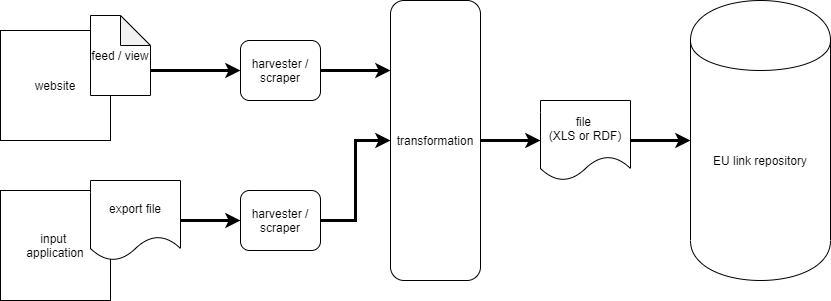

# Link repository tools

Automate the exchange of links to information on several regional/national pages to the EU link repository tool.

## Export / publish links to information, from existing sites

### For Drupal 7/8 websites

An easy way would be to 
- add a `part of SDG` checkbox field to the `content type` + a field with drop-down list of categories/SDG Annex events (`taxonomy`)
- create a [`View`](https://www.drupal.org/docs/8/core/modules/views) listing all the `nodes` having the `part of SDG` checkbox checked
  - with a title, description and link to the webpage
  - if the content is available in multiple languages, the `node ID` could be used to group (or remove) translations of the same content
- either publish this View as a:
  - newsfeed (RSS/XML, JSON...), which should be fairly easy to process automaticaly
  - or as an HTML webpage, which could be scraped and may require some extra coding

## Collect / harvest the the links from the various sources

TO DEVELOP

For scraping HTML with Java, there are several open source libraries e.g.
- [JSoup](https://jsoup.org/)
- [attoparser](https://www.attoparser.org/)

## Transform to an input format suitable for the EU link repository

TO DEVELOP

For writing CSV with Java, there are several open source libraries, e.g.
- [OpenCSV](http://opencsv.sourceforge.net)
- [Jackson Dataformats Text](https://github.com/FasterXML/jackson-dataformats-text)

For writing RDF with Java:
- [Eclipse rdf4j](https://rdf4j.org/)
